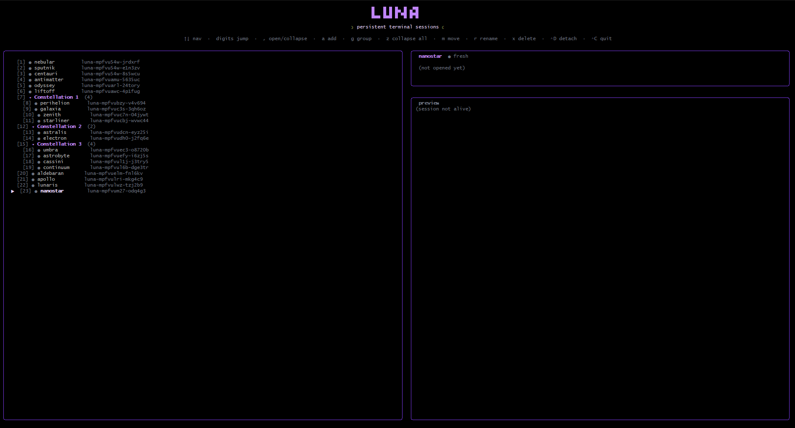

<div align="center">

<pre>
█   █ █ █▄ █ ▄▀█
█▄▄ █▄█ █ ▀█ █▀█
</pre>

### **The simplest terminal multiplexer.**



</div>

---

<div align="center">

*tmux power, zero tmux pain.*

</div>

luna gives you persistent terminal sessions in a clean, navigable launcher. Open one. Do your work. Press `Esc` to detach. Come back tomorrow — everything's exactly where you left it.

**No prefix keys. No chord shortcuts. No manual.** Arrows and Enter cover 90% of what you need.

---

## Why luna?

tmux is the most powerful terminal multiplexer ever built. Its keybindings are also why most people never touch it.

luna is the friendly face: a single-screen launcher that wraps tmux's machinery in a UI you can use **without ever reading the tmux manual**.

| | tmux raw | luna |
| --- | --- | --- |
| Open a new session | `tmux new -s foo` | press `a` |
| Switch sessions | `Ctrl+B s` then arrows | arrow keys |
| Detach a session | `Ctrl+B d` | `Esc` |
| See what's running in another session | attach to it and look | live preview on the right |
| Find session #47 | `tmux ls`, eye-search | type `4+7` |
| Rename | `Ctrl+B $` | press `r`, type name |

All sessions live on an isolated `tmux -L luna` socket, so luna won't touch your existing tmux setup.

---

## Features

- 🎯 **Zero learning curve** — arrows + Enter, that's the whole UX
- 💾 **Real persistence** — sessions survive disconnects, crashes, reboots
- 👁️ **Live previews** — see each session's last lines + cwd + foreground command without opening it
- 🏷️ **Custom names** — rename slots to `api`, `logs`, `deploy`, whatever
- ➕ **Unlimited sessions** — type `1+8+0` to jump to slot 180 instantly
- 🟢 **Status at a glance** — green dot = running, red = died, grey = never opened
- 🎨 **Beautiful by default** — purple palette, ASCII banner, soft rounded borders
- 🛡️ **Clean detach** — `Esc` leaves the session running, `exit` destroys it
- ⚙️ **Hackable** — every tmux command lives in one editable JSON file

---

## Install

```bash
git clone https://github.com/yourname/luna
cd luna
bun install
```

Requirements:
- [**Bun**](https://bun.sh) ≥ 1.0
- **tmux** ≥ 3.2 (for `display-popup`)
- **bash**

Runs natively on Linux and macOS. On WSL it works fully — Ink can flicker on Windows Terminal; see [troubleshooting](#troubleshooting).

---

## Run

### Recommended: `./luna` (works everywhere)

From the project root in any bash environment — **Linux, macOS, WSL, or MSYS2**:

```bash
./luna                # default: session named "luna"
./luna global         # start (or reattach) a session named "global"
./luna work           # different named session, runs independently
```

`./luna <name>` is **create-or-reattach**:
- If a tmux session by that name already exists → attach to it.
- If not → create it (status bar off), launch luna inside, then attach.

This lets you keep multiple luna instances on the same machine — each in its own named session, each with its own slot list/popups, all independent.

To explicitly **reattach** to an existing session without risking creating a new one:

```bash
./luna attach global
```

To **list every luna session** (outer named sessions and popup sessions on the `-L luna` socket, side-by-side):

```bash
./luna ls
```

Output looks like:

```
Outer sessions (default socket):
  luna: 1 windows (created ...)
  global: 1 windows (created ...) (attached)
  work: 1 windows (created ...)

Popup sessions (-L luna socket):
  luna-mabc-xyz: 1 windows (created ...)
  luna-mdef-uvw: 1 windows (created ...)
```

Use the names from the top group with `./luna attach <name>` or `./luna kill <name>`.

To **kill a specific outer session** by name:

```bash
./luna kill global
./luna kill work
```

Runs `tmux kill-session -t <name>` on the default socket. Use this to clean up named luna sessions you created with `./luna global` / `./luna work` / etc. without nuking everything.

To **nuke all popup sessions** that luna has accumulated on its `-L luna` socket (handy when too many dead/orphan popups pile up — `tmux ls` doesn't show them, since they live on a different socket):

```bash
./luna kill-all
```

This runs `tmux -L luna kill-server`, wiping every popup session in one shot. Your outer `luna` tmux session (the one running the luna UI) is untouched — only the per-slot popup sessions get cleared.

### Alternative: `bun start` (Linux / macOS / WSL only)

```bash
bun start
```

This runs `bin/start.sh`, which has slightly more setup (LUNA_CWD env var, etc.). **Doesn't work reliably from MSYS2** due to a pty handoff issue — on Windows always use `./luna` instead.

### Windows-specific setup (MSYS2)

luna runs on native Windows through **MSYS2**, which provides bash + tmux as Windows-native binaries — no WSL needed.

**One-time setup:**

1. Install MSYS2:
   ```powershell
   winget install MSYS2.MSYS2
   ```
2. Open the **MSYS2** shell (Start menu → "MSYS2 MSYS"), then install tmux:
   ```bash
   pacman -Syu
   pacman -S tmux
   ```
3. Make Windows-side `bun` reachable from MSYS2. Easiest is to inherit Windows PATH globally — in PowerShell:
   ```powershell
   [System.Environment]::SetEnvironmentVariable('MSYS2_PATH_TYPE', 'inherit', 'User')
   ```
   Close all MSYS2 windows, open a fresh one, verify with `bun --version`.

   Alternatively, just add bun's directory in `~/.bashrc`:
   ```bash
   export PATH="/c/Users/YOUR_WINDOWS_USER/.bun/bin:$PATH"
   ```

Then from MSYS2:

```bash
cd /d/path/to/luna
./luna
```

---

## Controls

### Navigating

| Key | Action |
| :-: | --- |
| `↑` `↓` | Move selection |
| `1`–`9` | Jump to slot 1–9 |
| `1+2+3` | Jump to slot 123 (`+` extends the number) |
| `↵` | Open the focused slot |

### Managing slots

| Key | Action |
| :-: | --- |
| `a` | Add a new slot |
| `r` | Rename the focused slot (`↵` to apply, `Esc` to cancel) |
| `⌃C` | Quit luna |

### Inside a session popup

| Key | Action |
| :-: | --- |
| `Esc` | Detach (session keeps running, popup closes) |
| `exit` / `⌃D` | Destroy the session |
| `⌃B` `[` | tmux copy mode (scroll back through history) |

---

## Slot status

Every slot has a colored dot telling you what it is:

| Dot | State | Meaning |
| :-: | --- | --- |
| ⚪ | `fresh` | Never opened |
| 🟢 | `alive` | Running, ready to reattach |
| 🔴 | `dead` | Was opened, then destroyed |

To bring a `dead` slot back, just press `↵` again — luna spins up a new session on the slot's stable id.

---

## How it works

Every slot is mapped to a stable tmux session id like `luna-mabc-xyz`. When you hit `↵`:

1. luna ensures the session exists (creates if missing) on the `-L luna` socket
2. tmux `display-popup` opens, attaching to that session
3. You work; the popup is just tmux
4. `Esc` detaches → popup closes → session continues running
5. Back in luna, a poll every second updates the info card + preview from `tmux capture-pane`

luna never holds your shells hostage. It's a thin overlay on top of real tmux sessions you could also drive with `tmux -L luna attach -t <id>` directly.

---

## Customizing tmux behavior

Every tmux command luna runs lives in **[`tmux-commands.json`](./tmux-commands.json)**:

```json
{
  "commands": [
    "tmux -L luna has-session -t {{session}} 2>/dev/null || tmux -L luna set-option -g history-limit 50000 \\; new-session -d -s {{session}} \\; set-option status off",
    "tmux -L luna set-option -g status off",
    "tmux -L luna set-option -g escape-time 10",
    "tmux -L luna bind-key -T root Escape detach-client",
    "tmux display-popup -w 95% -h 80% -E 'TMUX= tmux -L luna attach -t {{session}}'"
  ]
}
```

Tweak the popup size, change the detach key, add hooks, set environment variables — it's just shell commands. `{{session}}` gets replaced with the slot's session id at runtime.

---

## Project layout

```
src/
  index.tsx          entry — renders <App />
  App.tsx            main component: state, input, layout
  config.ts          colors, banner, name pool, intervals
  types.ts           Slot, Status, Info, Snapshot
  tmux.ts            subprocess helpers + state dedup
  utils.ts           formatting, random naming
  components/
    Banner.tsx       memoized ASCII logo
    SlotRow.tsx      memoized list row
    InfoCard.tsx     memoized right-pane info
    PreviewPane.tsx  memoized live tail
tmux-commands.json   tmux command templates
bin/start.sh         launcher (wraps luna in outer tmux)
```

Built on **Bun + React + Ink + tmux**.

---

## Troubleshooting

### Flicker on WSL

Ink does clear-and-redraw of the dynamic area on every state change. On Linux/macOS it's invisible; on WSL the `WSL pty → Windows Terminal` rendering path makes it visible.

In order of effort, lightest to heaviest:

1. **Use WezTerm or Alacritty** instead of Windows Terminal — they handle escape sequences much better.
2. **SSH into WSL** from a native Windows terminal — bypasses the WSL pty layer entirely.
3. **Use native Linux/macOS** — completely smooth.

### Old sessions don't come back when I restart luna

By design — each luna launch generates fresh session ids. The old sessions still exist on the `luna` tmux socket (`tmux -L luna ls` to see them), they're just orphaned. Persistence across luna restarts is a small change to the slot init if you want it.

### I can't scroll back through old output

The preview shows only the latest lines (sliding tail window). To browse history, open the popup and use tmux's copy mode: `Ctrl+B [`, then arrow keys / `PgUp` / `q` to exit. Full tmux scrollback (`history-limit 50000`) is available there.

---

## License

MIT.

---

<div align="center">

*made with 🌙 and tmux*

</div>
